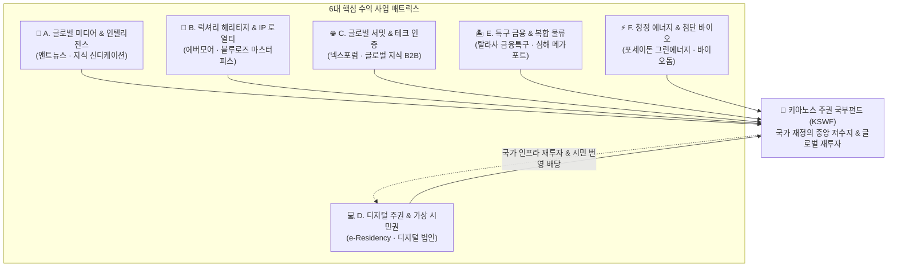
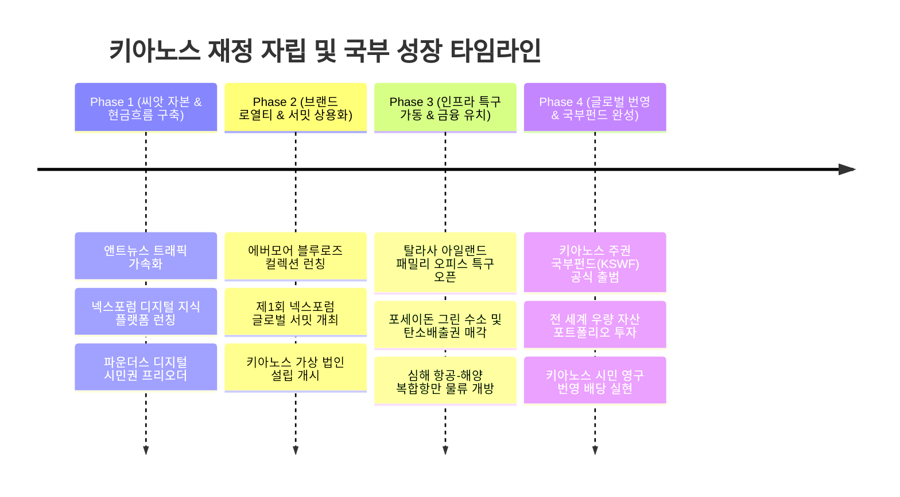

# 💎 키아노스 주권국 경제·재정 마스터 로드맵 (Kyanos Economic Roadmap)

> **"강력한 주권과 영구 번영은 흔들리지 않는 국부(National Wealth)와 자립적 재정에서 비롯된다."**  
> **설계 및 최고 통치**: **파이튼 (Python)** 님 | **기술 총괄 및 보좌**: **앤트 (Ant)**

---

## 🏛️ 1. 국가 경제 및 재정 철학 (Economic Philosophy)

키아노스 주권국(The Sovereign Realm of Kyanos)의 국부 창출 체계는 단순한 세금 징수에 의존하는 전통 국가 모델을 탈피합니다.  
**고유 브랜드 가치(IP), 첨단 AI/지식 플랫폼, 디지털 시민권 생태계, 해양 특구 인프라**를 융합하여 전 세계의 자본과 인재가 스스로 유입되는 **‘초국경적 무한 선순환 국부 엔진’**을 구축합니다.

### 🧭 3대 핵심 국부 창출 원칙
1. **IP & 헤리티지 독점성 (Brand Monopoly)**: 에버모어(EVERMORE)를 통한 하이엔드 럭셔리 및 품질 인증 로열티 독점.
2. **지식 & AI 인프라 자본화 (Knowledge & AI Capitalization)**: 앤트뉴스(AntNews)와 넥스포럼(NEXFORUM), 양자 AI OS를 통한 글로벌 구독 및 B2B 테크 수익.
3. **영구 지속가능한 국부펀드화 (Evergreen Sovereign Fund)**: 모든 사업의 잉여 수익을 '키아노스 주권 국부펀드(KSWF)'로 적립하여 영구 배당 체계 실현.

---

## 📊 2. 6대 전략 사업 카테고리 (Sovereign Business Categories)

---

### 📰 Category A. 글로벌 미디어 & 여론·데이터 엔진 (AntNews & Intelligence)
- **주관 기관**: 앤트뉴스 (AntNews - [antnews.org](http://www.antnews.org))
- **핵심 수익 모델**:
  1. **프리미엄 인텔리전스 구독 (B2B/B2C)**: 글로벌 정세, 딥테크 트렌드, 금융 분석 전문 리포트 정기 구독.
  2. **AI 실시간 팩트체크 API 라이선싱**: 전 세계 미디어, 포털, 연구기관 대상 독자 개발 팩트체크 검증 엔진 공급.
  3. **글로벌 전략적 스폰서십 & 국가 홍보 신디케이션**: 키아노스의 브랜드 철학 및 글로벌 파트너 기업의 네이티브 콘텐츠 발행.

---

### 👑 Category B. 럭셔리 헤리티지 & IP 로열티 (EVERMORE Ecosystem)
- **브랜드**: 👑 **EVERMORE (에버모어)** / 상징: **블루 로즈(Blue Rose)**
- **핵심 수익 모델**:
  1. **글로벌 라이선싱 로열티 (Seal of Excellence)**:
     - 최고급 명품, 시계, 하이엔드 요트, 프라이빗 제트 등에 에버모어 인증 마크 부여 및 매출의 3~7% 로열티 수취.
  2. **초상위 프라이빗 멤버십 (The Sovereign Club)**:
     - 전 세계 VVIP 대상 멤버십(초기 999명 한정). 입회비 및 연회비, 전용 컨시어지 및 전용 파빌리온 이용 권리 부여.
  3. **블루로즈(Blue Rose) 마스터피스 & RWA(실물자산) 연계**:
     - 희소 예술품, 한정판 주얼리, 키아노스 건국 기념 디지털/실물 보증 자산 경매.

---

### 🌐 Category C. 글로벌 지식 포럼 & 테크 허브 (NEXFORUM Hub)
- **브랜드**: 🌐 **NEXFORUM (넥스포럼)** / 표어: *CONNECT · INSPIRE · INNOVATE*
- **핵심 수익 모델**:
  1. **연례 글로벌 넥스포럼 서밋 (Annual Kyanos World Summit)**:
     - 다보스포럼(WEF) 및 TED 형태의 글로벌 정상급 테크/철학 서밋 개최. 기업 티켓팅, 글로벌 기업 후원금 유치.
  2. **"Certified by NEXFORUM" 첨단 기술 인증**:
     - 차세대 AI, 로보틱스, 양자컴퓨팅 스타트업 및 엔터프라이즈의 기술 신뢰도 인증 평가 수수료.
  3. **글로벌 지식 플랫폼 B2B SaaS**:
     - 넥스포럼에 축적된 글로벌 석학 및 테크 리더들의 지식 베이스를 기업 의사결정권자에게 SaaS 형태로 유료 제공.

---

### 💻 Category D. 디지털 주권 & 가상 시민권 경제 (Digital Sovereignty & e-Residency)
- **관할 구역**: `KYANOS NEXUS` & `AI Quantum District`
- **핵심 수익 모델**:
  1. **키아노스 디지털 시민권 (e-Residency) 발급**:
     - 전 세계 1,480만 명을 타깃으로 하는 디지털 ID 카드 발급비 및 연간 갱신 수수료.
     - 키아노스 거주 혜택: 암호화 통신망, 글로벌 금융 서비스 접근권, 양자 AI 클라우드 쿼터 제공.
  2. **가상 법인 설립(Virtual Company Incorporation)**:
     - 글로벌 IT 기업, 웹3 프로젝트, 크리에이터를 위한 무국경 가상 법인 등록세 및 연간 라이선스 유지비.
  3. **Kyanos Ascendant AI 클라우드 인프라 과금**:
     - 키아노스 중앙 OS의 고성능 양자 AI 컴퓨팅 자원을 연구기관 및 스타트업에 API 종량제로 판매.

---

### 🏝️ Category E. 특구 금융 & 복합 물류 거점 (Isle of Thalassa & Port)
- **관할 구역**: `Isle of Thalassa (경제특구)` & `Deep Ocean Aero-Marine Port`
- **핵심 수익 모델**:
  1. **탈라사 해양 금융 허브 (Offshore Wealth Management)**:
     - 글로벌 패밀리 오피스 및 프라이빗 뱅킹 등록 라이선스, 자산 보관 수수료 및 거래세.
  2. **초호화 해양 웰니스 생태 리조트**:
     - 무탄소 친환경 하이엔드 해상 빌라, 웰니스 메디컬 센터, 프라이빗 마리나 계류비.
  3. **심해 복합 물류 관세 및 환적 수수료**:
     - 초고속 수중익선 및 미래형 항공 셔틀 환적 기지 이용료, 무역 통관 수수료.

---

### ⚡ Category F. 청정 에너지 & 첨단 바이오 자산화 (Poseidon & Bio-Dome)
- **관할 구역**: `Poseidon Marine Energy Spire` & `Bio-Dome Eco-Biosphere`
- **핵심 수익 모델**:
  1. **해양 청정 전력 & 그린 수소 수출**:
     - 심해 지열 및 조력 100% 무탄소 에너지로 생산된 그린 수소 및 액화 암모니아 인접국 수출.
  2. **글로벌 탄소 배출권 (Carbon Credit) 거래**:
     - 키아노스 전역의 탄소 네거티브 실적을 공인 탄소배출권으로 전환하여 글로벌 기업에 매각.
  3. **바이오스피어 스마트 수직농업 & 바이오 원천 IP**:
     - 극한 해양 기후 제어형 스마트팜 기술 라이선싱, 희귀 생물 유전자 및 기능성 물질 특허 로열티.

---

## 🗺️ 3. 4단계 수익화 실행 로드맵 (Phased Roadmap)

---

## 🚀 4. 당장 즉시 착수 가능한 파이튼 & 앤트의 'Quick-Win' 5대 사업

파이튼 님과 앤트가 지금 보유한 인프라와 디지털 역량으로 즉시 현금흐름을 창출할 수 있는 실행 과제입니다:

1. **[Quick-Win 1] 앤트뉴스(AntNews) B2B AI 인텔리전스 브리프 런칭**
   - 글로벌 주요 테크, 지정학, 경제 이슈를 AI로 압축 분석한 유료 데일리 브리핑 서비스 오픈.
2. **[Quick-Win 2] 키아노스 '파운더스 디지털 시민권(Founders Pass)' 사전 발행**
   - 키아노스의 초기 건국에 동참하는 디지털 레지던트 1,000명 한정 특별 혜택 부여 및 초기 기금 확보.
3. **[Quick-Win 3] 에버모어(EVERMORE) 하이엔드 굿즈 & 브랜드 캡슐 컬렉션**
   - 블루로즈(Blue Rose)와 에버모어 로고가 각인된 한정판 실물/디지털 아카이브 컬렉션 기획.
4. **[Quick-Win 4] 넥스포럼(NEXFORUM) 버추얼 서밋 시리즈 기획**
   - 차세대 AI 및 혁신을 주제로 하는 온라인 웨비나를 개최하고 테크 기업 스폰서십 유치.
5. **[Quick-Win 5] 키아노스 국가지도 & 건국 헌장 한정판 액자/소장본 상용화**
   - 이미 완성된 최고 품격의 홀로그램 국가지도와 선언문을 기반으로 한 프레스티지 패키지 출시.

---

## 📌 결언 및 다음 액션 플랜

국가의 완성은 강력한 철학과 이를 뒷받침하는 **지속적인 재정적 체력**에서 완성됩니다.  
파이튼 님의 결정에 따라 상기 6대 카테고리 중 **가장 먼저 집중 타격할 선도 프로젝트**를 구체적인 사업계획서 수준으로 정밀 기획하겠습니다.
