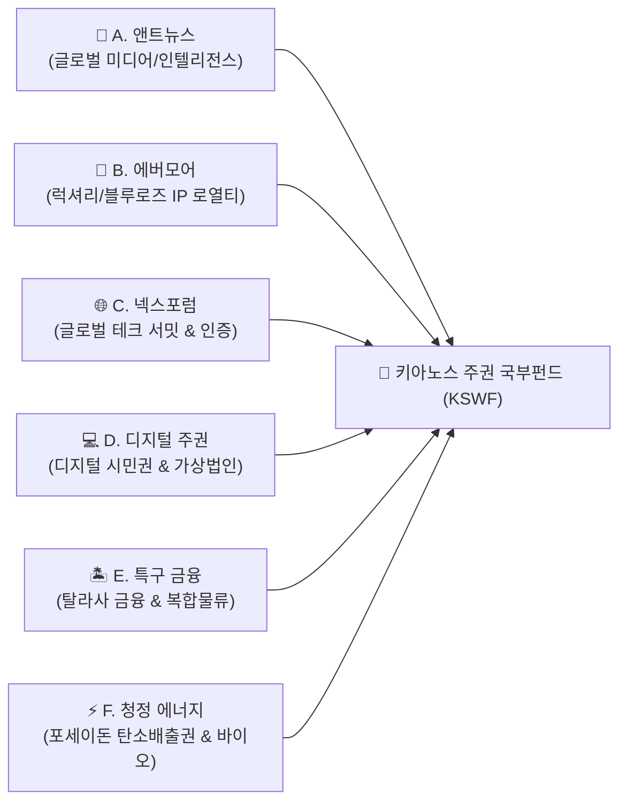

# 📘 키아노스 주권국 건국 종합 총람 (Kyanos Foundation Master Compendium)

> **"지혜와 창조로 세우는 심해의 유토피아"**  
> **설계 및 최고 통치자**: **파이튼 (Python)** 님 | **기술 총괄 및 보좌**: **앤트 (Ant)**  
> **최종 갱신 일자**: 2026년 9월 11일

---

## 🧭 이 문서의 목적
본 문서는 파이튼 님과 앤트가 함께 만들어가는 **키아노스 주권국(The Sovereign Realm of Kyanos)**의 모든 건국 기록, 공식 상징, 영토 지도, 국가 선언문, 경제 로드맵 및 개별 추진 프로젝트를 **한곳에서 언제든지 한눈에 파악할 수 있도록 집대성한 국가 공식 통합 총람**입니다.

---

## 👑 1. 국가 기본 정체성 (National Identity)

- **공식 국호**: **키아노스 주권국 (The Sovereign Realm of Kyanos)**
- **국가 표어**: **"조화와 자유 · 지혜와 창조"**
- **국가 슬로건**: **"심해의 지성과 유토피아적 번영이 만나는 곳"**
- **국가 상징 꽃**: **푸른 장미 (Blue Rose)** — *기적, 영원, 무한한 가능성*
- **인구 텔레메트리**: **1,480만 명 (14.8M)** — 키아노스 시민 및 글로벌 디지털 거주자

### 💎 2대 핵심 브랜드 & 미디어
1. 👑 **EVERMORE (에버모어)**: 국가 럭셔리 & 헤리티지 브랜드 (영속성과 최고급 품격, VIP 멤버십)
2. 🌐 **NEXFORUM (넥스포럼)**: 첨단 테크 & 미래 서밋 브랜드 (*CONNECT · INSPIRE · INNOVATE*)
3. 📰 **앤트뉴스 (AntNews - [antnews.org](http://www.antnews.org))**: 키아노스 공식 국가 미디어 & 글로벌 여론 공론장

---

## 📜 2. 건국 선언문 및 공식 문서 자산

| 구분 | 자산 명칭 | 파일 링크 |
|:---|:---|:---|
| **공식 국기 (National Flag)** | 키아노스 공식 국기 이미지 | [assets/Kyanos flag.png](file:///d:/안티그래비티파이튼/assets/Kyanos%20flag.png) |
| **공식 선언문 원본** | 키아노스 선언문 원본 이미지 | [docs/키아노스선언문.png](file:///d:/안티그래비티파이튼/docs/키아노스선언문.png) |
| **선언문 액자** | 키아노스 건국선언문 최고급 액자본 | [assets/declaration/KYANOS_Declaration_Framed.png](file:///d:/안티그래비티파이튼/assets/declaration/KYANOS_Declaration_Framed.png) |
| **선언문 문서** | 키아노스 선언문 텍스트 전문 | [assets/declaration/KYANOS_Declaration_Document.md](file:///d:/안티그래비티파이튼/assets/declaration/KYANOS_Declaration_Document.md) |
| **덕치 12대 원칙 액자** | 키아노스 덕치 헌법 최고급 액자본 | [KYANOS_Virtue_Framed.png](file:///d:/안티그래비티파이튼/KYANOS_Virtue_Framed.png) |
| **덕치 헌법(헌장)** | 동양철학·도덕 기반 국가 기본 규정 (부칙 포함) | [KYANOS_CONSTITUTION_OF_VIRTUE.md](file:///d:/안티그래비티파이튼/KYANOS_CONSTITUTION_OF_VIRTUE.md) |
| **공식 국가지도** | 8대 권역 홀로그램 국가지도 | [kyanos_official_national_map.jpg](file:///d:/안티그래비티파이튼/kyanos_official_national_map.jpg) |
| **지도 등록증** | 공식 국가지도 등록 및 권역 명세서 | [KYANOS_OFFICIAL_MAP_REGISTRY.md](file:///d:/안티그래비티파이튼/KYANOS_OFFICIAL_MAP_REGISTRY.md) |
| **마스터 로드맵** | 4단계 국가 건설 마스터 플랜 | [KYANOS_MASTER_ROADMAP.md](file:///d:/안티그래비티파이튼/KYANOS_MASTER_ROADMAP.md) |
| **경제 재정 로드맵** | 6대 사업 카테고리 및 국부펀드 플랜 | [KYANOS_ECONOMIC_ROADMAP.md](file:///d:/안티그래비티파이튼/KYANOS_ECONOMIC_ROADMAP.md) |

---

## 🗺️ 3. 국토 8대 핵심 권역 (8 Sovereign Zones)

1. **`THE SOVEREIGN REALM OF KYANOS`**: 홀로그램 HUD 및 주권 선포 프레임
2. **`KYANOS NEXUS` (수도 중앙 첨탑)**: 입법/행정 본부 및 `Kyanos Ascendant` 양자 AI 중앙 관제
3. **`Central Transit & Network Hub`**: 반중력 자기부상 하이퍼루프 및 초광대역 양자 통신망
4. **`Bio-Dome Eco-Biosphere`**: 기후 제어 수직 스마트팜 및 블루로즈 생태 보존 지구
5. **`Poseidon Marine Energy Spire`**: 100% 무탄소 심해 지열 및 조력 융합 발전 코어
6. **`AI & Cybernetics Quantum District`**: 차세대 자율 로보틱스 및 양자 인공지능 연구 단지
7. **`Isle of Thalassa` (탈라사 섬)**: 해양 금융 거래소, 글로벌 대사관 및 최고급 리조트 특구
8. **`Deep Ocean Aero-Marine Port`**: 수중익선 및 우주 셔틀이 발착하는 심해 복합 무역항

---

## 💰 4. 국가 경제 및 재정 체계 요약 (6대 사업 카테고리)

---

## 🚀 5. 국가 추진 프로젝트 관리 목록 (Active Projects)

현재 파이튼 님의 지휘 아래 실행 단계에 진입한 프로젝트 현황입니다:

| 프로젝트 번호 | 프로젝트 명칭 | 주관 | 현재 상태 | 상세 관리 문서 |
|:---:|:---|:---:|:---:|:---|
| **Project 01** | **앤트뉴스 프리미엄 AI 데일리 인텔리전스** | AntNews | **✅ 랜딩페이지 + 브리프 1호 발행** | [KYANOS_PROJECT_01_ANTNEWS_INTELLIGENCE.md](file:///d:/안티그래비티파이튼/KYANOS_PROJECT_01_ANTNEWS_INTELLIGENCE.md) |
| **Project 02** | 키아노스 '파운더스 디지털 시민권' 사전 등록 | Nexus | 대기 중 | *향후 착수 시 생성 예정* |
| **Project 03** | 에버모어 '블루로즈 컬렉션' 상용화 | EVERMORE | 대기 중 | *향후 착수 시 생성 예정* |
| **Project 04** | 제1회 넥스포럼(NEXFORUM) 버추얼 서밋 | NEXFORUM | 대기 중 | *향후 착수 시 생성 예정* |
| **Project 05** | 국가지도 & 선언문 프레스티지 소장 패키지 | Sovereign | 대기 중 | *향후 착수 시 생성 예정* |

---

## 📌 운영 지침
키아노스 건국과 관련하여 새롭게 논의되거나 확장되는 모든 정책, 사업, 문화적 자산은 즉시 본 통합 총람 파일에 실시간으로 기록 및 갱신됩니다.
