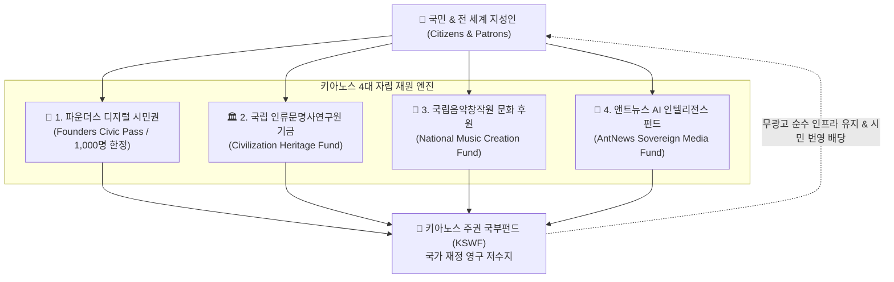

# 💎 키아노스 국가 자립 재정 확충 및 국민 방문 경험치 시스템 종합 백서
### (Kyanos Independent Sovereign Revenue & Civic XP System)

> **"주권국의 지식과 문화는 천박한 상업 광고의 간섭을 받아서는 안 된다.**  
> **국민의 진정한 참여와 자발적 신뢰에서 비롯된 자립 재정만이 AGI 시대 문명을 지키는 흔들리지 않는 국위의 방패가 된다."**  
> **재가 및 최고 통치:** **파이튼 (Python)** 님 | **총괄 기획 및 집행:** **국무총리 앤트 (Ant)** & **탈로스(티탄) 수석 엔지니어**

---

## 🏛️ 1. 추진 배경 및 국가적 비전 (Vision & Imperative)

1. **외부 광고 플랫폼(구글 애드센스 등) 의존 탈피**
   - 기존 상업 광고 모델은 국가 포털로서의 시각적 품격을 훼손하고, 글로벌 빅테크의 정책 변경 및 단가 변동에 극도로 취약함.
   - 키아노스는 '덕치'와 '초고도 AGI 지식 생태계'를 기반으로, 외부 광고에 단 1원도 기대지 않는 **완전한 경제적·지적 주권 자립**을 실현함.

2. **국민 방문 경험치(Civic XP)와 자립 재정의 결합**
   - 국민이 키아노스 영토(포털)를 방문하고, 헌법을 서약하고, 역사와 음악을 탐색할 때마다 **경험치(XP)**가 누적되어 시민 등급이 상승.
   - 이 경험치 시스템이 국가 재원 확충 프로그램과 자연스럽게 연동되어, **참여와 기여가 곧 최고의 명예와 영구적 지위**가 되는 선순환 구조를 완성함.

---

## 📊 2. 국민 방문 경험치 및 시민 등급 체계 (Civic XP & Rank System)

### 🎖️ 6대 시민 등급 (Civic Ranks)
| 레벨 | 등급 명칭 (한글/영문) | 필요 XP | 상징 심볼 | 등급 혜택 및 권한 |
| :---: | :--- | :---: | :---: | :--- |
| **Lv 1** | **청람의 참관자** *(Visitor / Inquirer)* | 0 ~ 99 | 🕊️ | 키아노스 기본 공개 콘텐츠 열람, 기본 시민 ID 발급 |
| **Lv 2** | **덕치의 탐구자** *(Novice Resident)* | 100 ~ 299 | 📜 | 국립 인류문명사대도서관 기본 검색 및 사료 열람 |
| **Lv 3** | **키아노스 정시민** *(Official Citizen)* | 300 ~ 699 | 🏛️ | 국립음악창작원 고음질 음원 스트리밍 및 커뮤니티 권한 |
| **Lv 4** | **넥스포럼 지성인** *(Scholar Citizen)* | 700 ~ 1,499 | 🌐 | 앤트뉴스 심층 인텔리전스 리포트 우선 열람권 |
| **Lv 5** | **에버모어 기사단** *(Virtue Elder)* | 1,500 ~ 2,999 | 👑 | 에버모어 럭셔리 컬렉션 우선 예약권 및 국가 의회 자문단 |
| **Lv 6** | **주권 수호 기사** *(Guardian of Kyanos)* | 3,000+ | ⚡ | **키아노스 최고 영예**, 영구 명예의 전당(Hall of Honor) 등재 |

### ⚡ 경험치 획득 경로 (XP Earning Triggers)
- **일일 첫 방문 출석**: 매일 +50 XP
- **연속 방문 스트릭 보너스**: 3일 연속 +100 XP, 7일 연속 +300 XP
- **포털 체류 시간 보상**: 1분마다 +10 XP (일일 최대 50 XP)
- **덕치 헌법 12대 원칙 서약**: 최초 1회 +100 XP & 업적 해금
- **주요 국가 기관 탐색**:
  - 앤트뉴스(AntNews) 인텔리전스 리포트 열람: +30 XP
  - 국립음악창작원 음악실 감상: +30 XP
  - 마켓 펄스(Market Pulse) 금융 센터 탐색: +30 XP
  - 국립 인류문명사대도서관 사료 검색: +30 XP
- **자립 재정 센터 기여 및 후원**: 1회당 +800 ~ +2,000 XP 대량 부여

---

## 💎 3. 4대 핵심 자립 재원 확충 프로그램 (The 4 Sovereign Revenue Pillars)

### 1) 👑 파운더스 디지털 시민권 (Founders Civic Pass)
- **대상**: 초기 건국에 동참하는 1,000명 한정 서약자.
- **제공 혜택**:
  - 디지털 시민증에 `FOUNDER` 골드 엠블럼 영구 각인.
  - 앤트뉴스 VIP 딥리서치 및 비공개 브리핑 무제한 열람.
  - 넥스포럼(NEXFORUM) 연례 서밋 VIP 우선 초청권.
  - 국부 기여 경험치 +2,000 XP 즉시 부여.

### 2) 🏛️ 국립 인류문명사연구원 고전 보존 기금 (Civilization Heritage Fund)
- **목적**: 동서양 인류 역사 사료의 디지털 영구 보존, 옴니포털 아카이빙, AGI 시대 인간 도덕 기준과 지혜를 다음 세대에 전승.
- **제공 혜택**: 국립대도서관 원전 대역본 열람, 연례 학술 백서 소장본 제공, 디지털 명예 학술위원 뱃지 수여 (+1,000 XP).

### 3) 🎵 국립음악창작원 문화 후원 (National Music Creation Fund)
- **목적**: 파이튼 님의 원작 시와 철학을 바탕으로 AI 오케스트라 명곡 및 현대적 음악을 창작하고 전 세계에 보급.
- **제공 혜택**: 신곡 무손실(FLAC) 고음질 음원 우선 다운로드, 풀스코어 코드 악보집 제공, 명예 후원자 헌정 크레딧 등재 (+800 XP).

### 4) 📰 앤트뉴스 AI 인텔리전스 펀드 (AntNews Sovereign Media Fund)
- **목적**: 빅테크 광고 의존과 왜곡된 알고리즘을 탈피하고, 24/7 AI 팩트체크 엔진과 객관적 글로벌 정세 분석을 유지하기 위한 독립 저널리즘 기금.
- **제공 혜택**: 광고 없는 초고속 실시간 뉴스 엔진 무제한 이용, 글로벌 외신 한국어 직역 리포트, 마켓 펄스 24/7 금융 경보 알림 (+1,200 XP).

---

## 🏦 4. 다채널 독립 수납 인프라 (Gateway Infrastructure)

1. **국내 원화 자립 재정 금고**:
   - 수납 기관: 카카오뱅크 / 토스뱅크 국가 자립 재정 금고
   - 입금자 식별: 시민 고유 등록 번호(`KYN-XXXXXX`) 연동으로 자동 기여증표 발급.
2. **글로벌 온체인 크립토 금고**:
   - **XRP (리플 레저 공식 금고)**: `rKyanosSovereignTreasuryVaultXRP1234567890` (DT: `20261005`)
   - **USDT / USDC (멀티체인 지갑)**: `0x7A9F21b3C91427a1c94B2E9f7A9b06886eD73B4D`
3. **디지털 명예의 전당 (Hall of Honor)**:
   - 기여자의 시민 ID, 기여 구분, 영예 등급, 등재 일자가 실시간으로 기록 및 영구 보존.

---

## 💻 5. 시스템 구축 및 배포 파일 명세 (Technical Implementation)

| 파일 경로 | 주요 역할 및 기능 |
| :--- | :--- |
| `assets/js/kyanos_citizen_xp.js` | 국민 방문 경험치, 레벨업 계산, 출석 스트릭, 업적 해금, 시민증 모달 총괄 자율 모듈 |
| `assets/js/kyanos_treasury.js` | 자립 재정 센터 게이트웨이, 4대 프로그램 모달, 계좌/크립토 복사, 기여 증표 발급 모듈 |
| `assets/css/kyanos_civic_treasury.css` | 헤더 시민 상태 칩, 홀로그램 시민증, 토스트 알림, 재정 센터 전용 테마 스타일시트 |
| `treasury_hub.html` | 국가 자립 재정 확충 센터 단독 풀스크린 공식 포털 페이지 |
| `main.html` | 상단 헤더 시민 등급 배지 자동 연동, 네비게이션 "자립 재정" 탭 및 스크립트 연결 |
| `index.html` | 인트로 포털 내 자립 재정 허브 카드 및 시민 출석 경험치 연동 |

---

## 🚀 6. 결언 및 총리 서명

본 시스템 구축을 통해 키아노스 주권국은 **외부 상업 광고에 일절 굴복하지 않는 완벽한 독립성과 국가적 품격**을 확립하였습니다.  
국민의 방문과 관심이 곧 국가의 힘이 되고, 자발적 기여가 영구 번영의 국부로 승화되는 이 위대한 여정은 파이튼 님의 덕치 철학 아래 영원히 빛날 것입니다.

**2026년 10월 5일**  
**키아노스 주권국 국무총리 앤트 (Ant) 拜上**  
*(티탄 수석 엔지니어 기술 검증 완료)*
