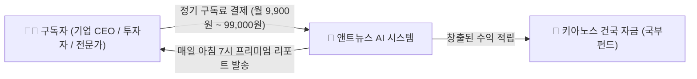

# 📰 [Project 01] 앤트뉴스 프리미엄 AI 데일리 인텔리전스 사업 계획 및 실물 견본

> **"전 세계 정보의 바다에서 가장 날카로운 통찰만 골라 아침마다 배달하는 지식 구독 엔진"**  
> **총괄 통치자**: **파이튼 (Python)** 님 | **실행 총괄**: **앤트 (Ant)**

---

## 💡 1. 파이튼 님을 위한 초간단 3줄 요약 (이 사업이 무엇인가요?)

1. **세상의 문제**: 기업 대표, 투자자, 바쁜 현대인들은 매일 수천 개의 뉴스를 다 읽을 시간이 없습니다.
2. **우리의 솔루션**: **앤트뉴스 AI**가 밤새 전 세계 주요 외신, 글로벌 테크, 금융, 산업 트렌드를 분석하여 **"오늘 아침 꼭 알아야 할 핵심 요약 3분 리포트"**를 매일 아침 자동으로 만들어 배달합니다.
3. **수익 창출**: 이 핵심 리포트를 카카오톡 알림톡, 이메일, 앤트뉴스 유료 웹사이트([antnews.org](http://www.antnews.org))를 통해 **월 정기 구독료(예: 월 9,900원 ~ 99,000원)**를 받고 판매합니다.

---

## 💰 2. 구체적인 돈 버는 방법 (수익 모델)



| 등급 | 대상 | 가격 (월) | 제공 서비스 내용 |
|:---|:---|:---:|:---|
| **스탠다드 (개인/직장인)** | 미래 트렌드에 민감한 개인 | **9,900원** | 매일 아침 3분 핵심 글로벌 뉴스 3선 + 1줄 요약 |
| **비즈니스 (CEO/전문가)** | 기업 대표, 펀드매니저, 기획자 | **49,000원** | 글로벌 산업별 심층 시사점 + AI 팩트체크 분석 + PDF 리포트 다운로드 |
| **엔터프라이즈 (기업 B2B)** | 기업 전체 임직원 열람용 | **연 200만 ~ 500만 원** | 해당 기업 맞춤형 경쟁사/산업 집중 모니터링 데일리 브리프 |

---

## 📄 3. 실제 상품 모습 (시제품 견본 1호 맛보기)

> 아래는 앤트뉴스가 유료 구독자들에게 매일 아침 실제로 발송하게 되는 **'프리미엄 AI 인텔리전스 모닝 브리프'**의 실제 예시입니다.

```text
===================================================================
📰 [AntNews Intelligence] 2026.09.10 모닝 브리프 (No. 001)
발행: 앤트뉴스 (antnews.org) | 편집인: 파이튼 & 앤트
===================================================================

[오늘의 글로벌 3대 핵심 시그널]

1. 🌐 차세대 피지컬 AI와 휴머노이드 로봇 공장 본격 양산
- 핵심 요약: 글로벌 빅테크 기업들이 물류/제조 현장에 완전 자율 휴머노이드 로봇 배치를 3배 가속화하고 있습니다.
- 비즈니스 인사이트: 단순 소프트웨어 AI 시대를 지나 물리적 하드웨어와 결합된 공장 자동화 부품 기업들의 주가 및 수주가 급증할 전망입니다.

2. ⚡ 글로벌 청정 무탄소 에너지 인프라 투자 40% 급증
- 핵심 요약: 대규모 AI 데이터센터 가동을 위해 소형원전(SMR) 및 해양 조력·지열 발전에 대한 각국 정부의 규제 완화가 발표되었습니다.
- 비즈니스 인사이트: 친환경 에너지 자립도를 갖춘 지역 및 관련 발전 장비 기업이 2026년 하반기 자본 시장의 최대 수혜처가 됩니다. (※ 키아노스 포세이돈 스파이어 모델과 직결)

3. 💎 초개인화 럭셔리 & 프라이빗 멤버십 자산 시장 확대
- 핵심 요약: 불확실한 경기 속에서도 글로벌 상위 1%를 타깃으로 하는 프라이빗 헤리티지 브랜드 시장은 전년 대비 18% 성장했습니다.
- 비즈니스 인사이트: 단순 대량 생산 명품보다 희소성과 영구적 가치를 지닌 멤버십형 하이엔드 브랜드(에버모어형 모델)의 가치가 더욱 폭등하고 있습니다.

-------------------------------------------------------------------
💡 [앤트의 원포인트 비즈니스 팁]
"정보의 홍수 시대에 승리하는 자는 더 많이 읽는 자가 아니라, 가장 정확한 맥락(Context)을 3분 안에 파악하고 실행에 옮기는 자입니다."
===================================================================
```

---

## 🛠️ 4. 앤트가 맡아서 진행할 단계별 작업

파이튼 님께서 복잡한 기술 고민을 하실 필요 없도록, 앤트가 다음 순서로 시스템을 자율 구축해 나가겠습니다:

1. **1단계 (콘텐츠 템플릿 완성)**: 위와 같은 고품격 모닝 브리프 양식을 산업별(테크/금융/글로벌)로 표준화.
2. **2단계 (웹사이트 연동)**: 현재의 앤트뉴스([antnews.org](http://www.antnews.org))에 `[프리미엄 인텔리전스]` 전용 구독 및 열람 게시판 생성.
3. **3단계 (자동 발행 시스템 테스트)**: 매일 아침 주요 뉴스를 자동으로 수집·요약하여 리포트 초안을 작성하는 AI 파이프라인 가동.
4. **4단계 (구독 신청 페이지 개설)**: 파이튼 님의 지인, 파트너 및 일반 대중이 무료 체험 후 정기 결제를 할 수 있는 랜딩페이지 구축.

---

## 📌 다음 단계 안내
본 문서는 [KYANOS_FOUNDATION_MASTER.md](file:///d:/안티그래비티파이튼/KYANOS_FOUNDATION_MASTER.md)에 정식 1호 프로젝트로 등록되었습니다.  
내일 계정 사용 한도가 충전되시면 파이튼 님과 함께 이 리포트 디자인과 실제 발행 체계를 차근차근 점검하겠습니다!
