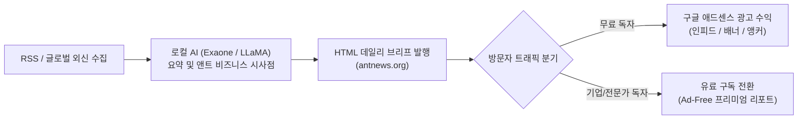

# 📰 AntNews (antnews.org) 구글 애드센스 승인 및 광고 효율 최적화 연구 리포트

> **총괄 통치자**: 파이튼 (Python) 님  
> **분석 및 연구**: 앤트 (Ant)  
> **대상 도메인**: `antnews.org` (GitHub Pages 연동 플랫폼)  
> **작성일**: 2026-10-01  

---

## 🎯 1. 연구 개요 및 목표

키아노스 국부 펀드 및 자체 수익 창출 프로젝트(Project 01)의 핵심 파이프라인인 **AntNews**에 구글 애드센스(Google AdSense)를 성공적으로 등록하고, 지속 가능한 광고 수익(eCPM / CTR 극대화)을 달성하기 위한 종합 분석 및 실행 로드맵입니다.



---

## 🛡️ 2. 애드센스 승인 통과 전략 (구글 정책 심사 대비)

구글 애드센스 승인 심사는 최근 **"가치 없는 콘텐츠(Thin/Low-value content)"**와 **"단순 AI 생성/스크레이핑 웹사이트"**에 대해 매우 엄격한 잣대를 적용하고 있습니다. AntNews가 단번에 심사를 통과하기 위한 핵심 충족 요건은 다음과 같습니다.

### (1) 단순 요약을 넘어서는 '독창적 부가가치 (Original Added Value)' 확보
- **위험 요인**: 단순 외신 RSS 제목/본문 복사본은 구글 봇이 '중복 콘텐츠'로 판정하여 심사 거절.
- **해결책**:
  1. 현재 `report_generator.py`에 적용된 **[💡 앤트의 비즈니스 시사점]**과 같은 자체적이고 독창적인 분석 텍스트를 최소 200~300자 이상 포함.
  2. 단순 기사 나열이 아니라, 산업별 태그(Tech, Finance, Geopolitics, Green Energy 등)와 주간/월간 트렌드 종합 리포트 섹션 추가.

### (2) 애드센스 필수 법적/정책 페이지 구비 (구글 심사관 필수 체크리스트)
구글 심사팀(수동 검토관 및 봇)은 웹사이트 하단(Footer)에 아래 4개 페이지 링크가 없으면 즉시 거절(사이트 탐색 불가 / 신뢰성 부족) 판정을 내립니다:
1. **About Us (소개)**: 앤트뉴스의 발행 취지, 편집 정책, AI 분석 방법론 명시.
2. **Privacy Policy (개인정보처리방침)**: 구글 애드센스 및 쿠키(Cookie), Google DoubleClick DART 쿠키 사용 고지 (필수).
3. **Terms of Service (이용약관 / 면책공고)**: 뉴스 인용 출처 명시 및 투자 조언이 아님을 밝히는 Disclaimer.
4. **Contact (문의처/제휴)**: 공식 연락 이메일 및 운영자 정보.

### (3) 승인 신청 전 콘텐츠 축적 기준
- **최소 20~30개 이상의 일별 브리핑 페이지**가 발행 및 Google Search Console에 인덱싱(색인)된 상태에서 신청.
- 도메인 루트(`antnews.org`) 및 하위 경로에서 404 에러나 빈 페이지가 없도록 관리.

---

## 📈 3. 광고 슬롯 배치 및 효율(CTR / eCPM) 극대화 연구

뉴스 미디어 웹사이트에서 사용자 이탈을 최소화하면서 노출률(Viewability)과 클릭률(CTR)을 극대화하는 배치 공식입니다.

```text
+-----------------------------------------------------------+
| [Header] AntNews Intelligence Daily                       |
+-----------------------------------------------------------+
| [광고 슬롯 1] 상단 반응형 리더보드 (728x90 ~ Fluid)       | <- 로딩 즉시 노출
+-----------------------------------------------------------+
| 📰 오늘의 핵심 브리핑 Top 3                               |
+-----------------------------------------------------------+
| ┌───────────────────────────────────────────────────────┐ |
| │ [기사 #01] 차세대 피지컬 AI ... (요약 + 시사점)       │ |
| └───────────────────────────────────────────────────────┘ |
| ┌───────────────────────────────────────────────────────┐ |
| │ [기사 #02] 글로벌 청정 에너지 ... (요약 + 시사점)     │ |
| └───────────────────────────────────────────────────────┘ |
| +-------------------------------------------------------+ |
| | [광고 슬롯 2] 뉴스 카드형 인피드(In-Feed) 네이티브 광고| | <- 최다 클릭 발생 영역
| +-------------------------------------------------------+ |
| ┌───────────────────────────────────────────────────────┐ |
| │ [기사 #03] 초개인화 럭셔리 자산 ... (요약 + 시사점)    │ |
| └───────────────────────────────────────────────────────┘ |
| +-------------------------------------------------------+ |
| | [광고 슬롯 3] 리포트 하단 결론 직후 일치하는 콘텐츠 광고| |
| +-------------------------------------------------------+ |
| [Footer] About | Privacy Policy | Terms | Contact         |
+-----------------------------------------------------------+
| [광고 슬롯 4] 모바일 하단 플로팅 앵커 광고 (Mobile Only)   | <- 안정적 RPM 바닥선
+-----------------------------------------------------------+
```

### 단위별 기대 효율 분석
| 광고 위치 | 광고 형태 | 특징 및 권장 이유 | 예상 eCPM 기여도 |
| :--- | :--- | :--- | :---: |
| **상단 헤더 하단** | 반응형 디스플레이 | 페이지 로드 직후 시야에 들어와 노출률(Viewability) 80% 이상 확보 | 보통 |
| **기사 카드 사이 (2~3번째 뒤)** | **인피드 (In-feed Native)** | 뉴스 카드 UI와 동일한 형태의 다크 테마 광고로 자연스러운 시선 유도, **클릭률(CTR) 1위** | **매우 높음** |
| **하단 시사점 직후** | 인아티클 (In-article) | 기사를 끝까지 정독한 고관여 독자에게 관련성 높은 타깃 광고 제공 | 높음 |
| **모바일 하단 고정** | 모바일 앵커 (Anchor) | 스마트폰 스크롤 중 상시 노출되어 모바일 트래픽 수익화 필수 요소 | 높음 |

---

## ⚙️ 4. 기술적 구현 및 자동화 파이프라인 연계 방안

### (1) `ads.txt` 루트 파일 생성
구글 애드센스 계정 승인 후 발급받는 고유 게시자 ID(`pub-xxxxxxxxxxxxxxxx`)를 프로젝트 루트에 `ads.txt`로 배치합니다:
```text
google.com, pub-XXXXXXXXXXXXXXXX, DIRECT, f08c47fec0942fa0
```

### (2) `report_generator.py` 템플릿 연동 구조
수동으로 매번 광고 코드를 삽입하지 않고, 파이썬 리포트 생성기에서 자동으로 알맞은 위치에 광고 슬롯을 삽입하도록 설계합니다.

```python
# report_generator.py 확장 설계 (예시)
ADSENSE_CLIENT_ID = "ca-pub-XXXXXXXXXXXXXXXX"
ADSENSE_SLOT_IN_FEED = "1234567890"

def get_infeed_ad_card():
    return f"""
    <div class="news-card ad-card-container">
        <ins class="adsbygoogle"
             style="display:block"
             data-ad-format="fluid"
             data-ad-layout-key="-fb+5w+4e-db+86"
             data-ad-client="{ADSENSE_CLIENT_ID}"
             data-ad-slot="{ADSENSE_SLOT_IN_FEED}"></ins>
        <script>(adsbygoogle = window.adsbygoogle || []).push({{}});</script>
    </div>
    """
```
- 기사 카드 3개마다 1회씩 인피드 광고 자동 교차 삽입
- 다크 테마 배경(`--bg-secondary`, `#1e293b`)과 위화감 없는 CSS 래퍼 적용

### (3) 웹 성능(Core Web Vitals) 및 로딩 지연 방지
- 광고 스크립트(`adsbygoogle.js`)는 `async` 속성으로 비동기 호출하여 뉴스 본문 렌더링을 차단하지 않도록 최적화.
- 광고 영역에 최소 높이(`min-height: 250px`)를 미리 지정하여 레이아웃 흔들림(CLS: Cumulative Layout Shift) 방지 (구글 SEO 감점 예방).

---

## 🚀 5. 즉시 실행 가능한 단계별 액션 플랜

1. **[1단계: 필수 정책 페이지 및 바닥글(Footer) 생성]**
   - `privacy.html`, `about.html`, `terms.html`을 `antnews_auto/templates` 및 배포 경로에 생성.
2. **[2단계: 콘텐츠 축적 및 Google Search Console 등록]**
   - 매일 아침 자동 파이프라인 가동으로 2~3주간 양질의 일별 리포트 데이터베이스 빌드.
   - sitemap.xml 및 robots.txt를 생성하여 구글 검색 로봇에 인덱싱 요청.
3. **[3단계: 구글 애드센스 사이트 등록 및 승인 신청]**
   - 파이튼 님의 구글 애드센스 콘솔에서 `antnews.org` 사이트 추가.
   - 메타 태그 / ads.txt 루트 업로드 후 심사 요청.
4. **[4단계: 승인 완료 후 인피드/자동 광고 활성화]**
   - 광고 단위 발급 후 `report_generator.py`에 슬롯 번호 입력하여 전면 가동.
   - 수익 지표(eCPM, CTR, 국가별 유입 트래픽) 모니터링 및 배치 미세 조정.
