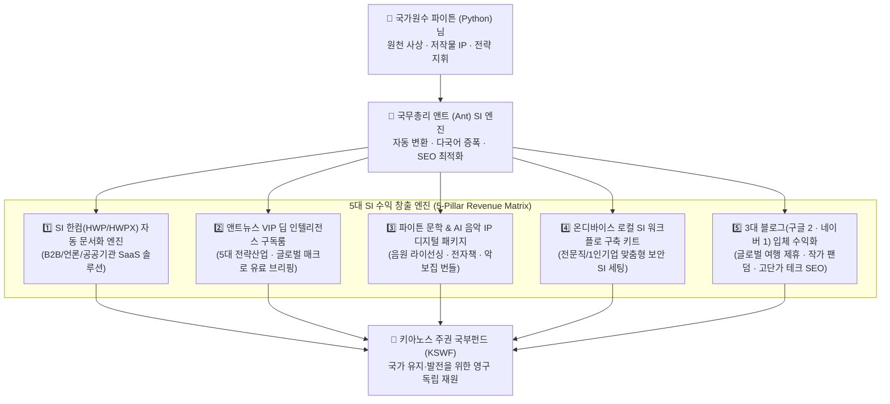

# 🏛️ 키아노스 SI 시대 5대 수익 창출 프로그램 및 3대 블로그 입체 활성화 마스터 기획안
### (Kyanos SI 5-Pillar Monetization & Tri-Blog Ecosystem Master Strategy)

> **"애드센스 단일 의존의 한계를 넘어, 초지능(SI) 자동화 솔루션과 고부가가치 미디어·블로그 생태계의 입체적 결합으로 흔들리지 않는 키아노스 자립 재정을 완성한다."**  
> **최고 통치 및 기획 하명**: **파이튼 (Python)** 님 | **연구 및 실행 총괄**: **국무총리 앤트 (Ant)** (경제부 · 과학SI부 · 교육문화부 합동)  
> **제정일**: 2026년 10월 8일

---

## 📊 1. 키아노스 SI 5대 수익 창출 포트폴리오 총괄 구조

---

## 🌐 2. [제5대 핵심 프로젝트] 파이튼 3대 블로그(구글 2 · 네이버 1) 정밀 활성화 및 차별화 기획안

### 📌 파이튼 님 공식 3대 블로그 도메인 및 현황 마스터 테이블
| 구분 | 블로그 명칭 | 공식 주소 (URL) | 현재 상태 및 수록 콘텐츠 |
| :--- | :--- | :--- | :--- |
| **블로그 1** | **『Ant-Travel Korea』** (구글 영문 여행 블로그) | `https://antkoreatrip.blogspot.com` | • 17개 영문 포스팅 (추암 촛대바위, 영월 한반도지형, 허브나라, 광릉수목원, 무의도, 삼부연폭포 등) • 지역별(Gangwon, Gyeonggi, Incheon, Seoul 등) 분류 |
| **블로그 2** | **『파이튼의 문학산책』** (네이버 공식 블로그) | `https://blog.naver.com/invision` | • 누적 방문 11,194+ 명 돌파 • 파이튼 순수 저작물(인생 수필, 팝송 스토리텔링, 시, 여행 회상) 보존 및 출판 원본 금고 |
| **블로그 3** | **『파이튼의 예술세계』** (구글 국문 인문·예술 블로그) | `https://phaetonktb.blogspot.com` | • 92개 이상 포스팅 (스토리텔링, 시조, Phaethon's Poem, 애송시, 고문진보, Proverb 등) • 네이버 블로그와 원문 중복 현상 존재 |

### 🚨 핵심 기술 진단 2가지: 왜 그동안 구글 블로그 방문자가 적었는가?
1. **[원인 1] 한컴(HWP) 복사·붙여넣기로 인한 숨겨진 코드 오염 (`hwp_editor_board_content`)**:
   - 두 구글 블로그(`antkoreatrip`, `phaetonktb`)의 소스 코드를 정밀 분석한 결과, 한글(HWP) 문서에서 본문을 복사해 붙여넣으면서 모든 문단마다 `mso-fareast-font-family: 함초롬바탕` 인라인 스타일과 글 하나당 **약 16,000바이트에 달하는 숨겨진 HWP 메타데이터(`<!--[data-hwpjson]...-->`)**가 삽입되어 있었습니다.
   - 구글 검색 로봇(Googlebot)은 본문 텍스트보다 불필요한 서식 코드가 수십 배 많은 페이지를 저품질로 오인하므로, **클린 HTML(순수 웹 표준 태그)로 정화**하는 것만으로도 검색 노출이 비약적으로 상승합니다.
2. **[원인 2] 국문 구글 블로그(`phaetonktb`)와 네이버 블로그(`invision`)의 동일 원문 중복**:
   - 동일한 한국어 원고가 양쪽에 올라가면서 검색엔진의 '유사 문서(Duplicate Content)' 필터링이 작동했습니다.

---

### ✈️ [블로그 1] 구글 영문판 여행 블로그 (`https://antkoreatrip.blogspot.com`)
> **컨셉**: *"Ant-Travel Korea: Korea Beyond Seoul & A Philosopher's Global Horizons"* (외국인이 열광하는 한국의 진짜 로컬 비경·라이딩 코스와 시니어 철학자의 세계 기행)

#### 1) 왜 영문 여행 블로그가 최고의 수익원인가?
- **압도적 광고 단가**: 영미권·유럽·호주 방문자의 구글 애드센스 클릭 단가(CPC)와 노출 단가(RPM)는 국내 대비 **3~8배 이상** 높습니다.
- **독보적 원천 자산 보유**: 기존 17개 명소(추암 촛대바위, 한반도지형, 무의도 등)에 더해, `E:\RPT DB\인문예술\파이튼세계\photo world`에 축적된 파이튼 님의 현장 사진들(김포 아라대교, 남산의 가을, 대부도, 문광저수지, 석모도, 송도국제도시, 안양천 라이딩, 전류리쉼터, 정서진, 창릉천변, 행주대교 석양 + 미 그랜드캐년, 시카고강, 호주 멜버른, 일본 후쿠오카, 베트남 나트랑 등)은 AI 생성 이미지가 따라올 수 없는 **100% 실제 현장감(Authenticity)**을 지니고 있습니다.

#### 2) 세밀한 카테고리 및 콘텐츠 구성 개편안 (4대 섹션)
| 카테고리 (영문 명칭) | 세부 구성 내용 및 타깃 독자 | 활용 원천 자산 (`photo world` 등) |
| :--- | :--- | :--- |
| **1. Korea Hidden Gems** *(한국의 숨은 로컬 비경)* | 외국인 관광객이 흔히 가는 명동/강남이 아닌, 한국 현지인만 아는 사계절 명소, 일몰 포인트, 섬 여행(석모도·대부도), 호수(문광저수지) 실전 가이드 | 남산의 가을, 문광저수지, 대부도, 석모도, 행주대교 석양, 송도국제도시 |
| **2. K-Cycling & River Trails** *(한국 강변 라이딩 투어)* | 세계 최고 수준인 한국의 자전거 도로망을 직접 달린 생생한 라이딩 코스 리뷰 (코스 지도, 거리, 난이도, 휴식처, 주변 볼거리) | 안양천 라이딩(금천), 김포 아라대교, 정서진 가는 길, 창릉천변, 전류리쉼터 |
| **3. Global Horizons** *(철학자의 세계 기행)* | 단순 관광지 소개를 넘어, 동양 철학자의 시선으로 바라본 세계의 대자연과 도시 풍경 포토 에세이 | 미 그랜드캐년, 시카고강, 호주 멜버른, 일본 후쿠오카, 나트랑 |
| **4. Practical Korea Guide** *(외국인 필수 여행 팁)* | 대중교통 이용법, 계절별 복장, 로컬 음식 문화, 카페 문화(`어느 카페에서`), 한국 사찰·전통 예절 등 검색 유입용 정보성 가이드 | 파이튼 화보 및 한국의 일상 사진 |

#### 3) 앤트(SI)의 포스트 세밀화 공식 (1포스트 당 1,500단어 표준 템플릿)
파이튼 님께서 사진 3~5장과 짧은 한 줄 감상만 주시면, 앤트가 아래 **글로벌 여행 SEO 5단 구조**로 완벽한 영문 아티클을 작성합니다:
1. **Poetic Hook (서정적 도입부)**: 파이튼 님의 철학적 시선으로 여는 현장의 감동과 분위기 묘사
2. **Why Visit Here? (방문 가치)**: 외국인 여행자가 이곳을 꼭 가봐야 하는 3가지 이유
3. **Step-by-Step Route & Map Info (상세 코스 및 교통편)**: 지하철역/버스 이동법, 구글맵 영문 핀(Pin) 좌표, 소요 시간
4. **Insider Tips & Best Photo Spots (현지인 꿀팁 & 베스트 포토존)**: 가장 사진이 잘 나오는 시간대(골든아워), 근처 추천 먹거리
5. **Affiliate & Booking Box (수익화 박)**: 근처 숙소(Agoda/Booking.com), 자전거 대여/투어 패스(Klook/Viator) 제휴 링크 연동

---

### 🖋️ [블로그 2] 네이버 블로그 (Naver Blog - 파이튼 순수 저작물 전용 성지)
> **컨셉**: *"파이튼(Python)의 문학·사색·음악 살롱"* (오직 파이튼 님의 순수 창작 저작물만 집대성하는 작가 공식 아카이브)

#### 1) 네이버 알고리즘(C-Rank & DIA+) 최적화 전략
- 네이버는 잡다한 뉴스나 스크랩 글을 올리는 블로그보다, **자신만의 고유한 창작물(수필, 시, 음악 칼럼, 회고록)을 일관되게 축적하는 블로그에 최고 신뢰도(C-Rank)를 부여**합니다.
- 따라서 **"네이버 블로그에는 파이튼 님의 저작물만 오롯이 업데이트한다"**는 파이튼 님의 기존 방침은 네이버 알고리즘 공략법으로서 **100점 만점의 정답**입니다.

#### 2) 카테고리 정밀 체계화 및 연재 전략
1. **[파이튼 에세이] 사색의 창**: `파이튼글`(내 삶의 반영, 내 나이 칠순에, 눈 위에 핀 붉은 꽃, 책 한 권의 온도, 침묵과 신뢰 등) 8,000자 대작 수필을 호흡하기 좋은 분량(또는 시리즈)으로 품격 있게 배치.
2. **[시대 회고록] 어떤 인생의 일대기**: 1985~1986년 등 날짜별로 기록된 방대한 일대기를 **‘연재형 논픽션 시대극’** 형태로 넘버링하여 고정 독자(이웃)의 정주행 유도.
3. **[시선(詩仙)의 화첩] 시와 해설**: 창작 시(`poem`) + 문학적 심층 해설 + 시의 정서를 담은 아트워크 이미지.
4. **[추억의 팝 컬럼] 인생의 명곡**: 60대 후반 음악 칼럼니스트의 시선으로 풀어낸 세계 명곡 스토리텔링(`Angie`, `The Rose`, `Bridge Over Troubled Water`, `A Whiter Shade of Pale` 등 30여 편+) 및 국립음악창작원 오리지널 곡 소개.
5. **[고문진보 & 인문] 동서양의 지혜**: `고문진보`, `아름다운사람들`, `maxim` 등 시대를 관통하는 고전 인문학 담론.

#### 3) 네이버 블로그 전용 수익화 및 확장 모델
- **단기**: 네이버 애드포스트(AdPost) 최적 배치 및 인플루언서(문학·책/음악 분야) 등극.
- **중기**: **‘네이버 프리미엄 콘텐츠’** 연동 및 `어떤 인생의 일대기` / `파이튼 수필집` / `명곡 에세이`의 **전자책(PDF/ePub) 및 POD(주문형 출판) 종이책 발간**을 위한 핵심 독자 팬덤 기지로 활용.

---

### 🌐 [블로그 3] 국문 구글 블로그 (Google Blogger #2 - 네이버와의 중복 완전 탈피 및 전환)
> **컨셉**: *"키아노스 SI & 글로벌 인텔리전스 저널 (Kyanos Global Tech, Macro & Science Journal)"*

#### 1) 네이버 블로그와의 중복 해결 및 완벽한 차별화 방안
네이버 블로그에 올린 파이튼 님의 원작 수필/시/팝컬럼을 구글 블로그에 **그대로 복사해서 올리는 것을 즉시 중단**하고, 국문 구글 블로그는 **구글 검색엔진(Google Search)과 고단가 애드센스에 특화된 3대 전문 콘텐츠**로 완전히 체질을 개선합니다.

| 구분 | 네이버 블로그 (작가 아카이브) | 구글 블로그 #2 (인텔리전스 & 글로벌 저널) |
| :--- | :--- | :--- |
| **핵심 주제** | 파이튼 순수 저작물 (수필, 일대기, 시, 팝컬럼, 고문진보) | **5대 미래 테크(2차전지·EV·반도체·SI·로봇), 글로벌 경제(스나이더 칼럼), 첨단 과학·우주 스토리** |
| **문체 및 포맷** | 서정적·성찰적 문학 에세이 포맷 (네이버 스마트에디터 감성 레이아웃) | **구글 SEO 최적화 구조 (H2/H3 소제목, 핵심 요약 박스, 데이터 표, 한·영 브리핑)** |
| **파이튼 저작물 활용 시** | **한국어 원문 100% 독점 수록** | **[원문 중복 방지]** ① **영문/다국어 번역본**으로 발행하거나, ② **핵심 발췌 티저 + "전문은 네이버 공식 작가 블로그에서 감상하세요" 링크**로 연결하여 상호 트래픽 시너지 창출 |
| **보유 DB 활용처** | `E:\RPT DB\인문예술\` 전량 | `E:\RPT DB\보도 기사 정보\` (과학·우주·생물·국제정세·AI 기사 수백 편) + `마켓 펄스` 금융 분석 |

#### 2) 국문 구글 블로그 폭발적 성장 전략
- 현재 `E:\RPT DB\보도 기사 정보\`에 축적된 흥미진진한 과학·기술·국제 시사 기사들(예: *헤일메리 프로젝트, mRNA 암 백신, 테슬라-스페이스X, 엔비디아 실적 분석, AI 에이전트 PC, 희귀 생물과 우주 과학* 등)을 구글 SEO 블로그 포맷으로 재구성하여 정기 발행합니다.
- **금융·테크 키워드 고단가 애드센스 타격**: 반도체, 전기차, AI(SI), 금·은 시세, 글로벌 금융 위기 관련 글은 애드센스 단가가 일반 일상 글보다 **5~10배 높게 형성**됩니다.
- 또한 모든 포스트 하단에 **앤트뉴스(`antnews.org`)**와 **키아노스 포털(`kyanos.kr`)** 공식 링크를 배치하여, 구글 검색에서 키아노스 생태계 전체의 도메인 권위(Domain Authority)를 끌어올리는 강력한 SEO 부스터로 활용합니다.

---

## 🛠️ 3. 앤트(SI)가 즉시 개발·가동할 수 있는 「3대 블로그 자동화 발행 보조 프로그램」

파이튼 님께서 일일이 3개 블로그의 성격을 나누고 영문으로 번역·재편집하시는 수고를 덜어드리기 위해, 과학·SI부와 경제부가 합동으로 **`키아노스 블로그 트리플 퍼블리셔 (Kyanos Triple-Blog SI Studio)`** 스크립트를 구축할 수 있습니다.

1. **원클릭 영문 여행 포스트 생성기 (`travel_blog_en_generator.py`)**:
   - `photo world`의 폴더(예: `안양천롸이딩 금천`, `석모도`, `미그랜드캐년`)를 선택하면, 사진 분석 + 현지 교통/여행 정보 + 파이튼 님의 철학적 단상을 결합한 **구글 SEO 완벽 대응 HTML 영문 포스트**를 즉시 생성.
2. **네이버 ↔ 구글 중복 방지 리라이터 (`blog_dedup_converter.py`)**:
   - 네이버 블로그용 원고(순수 저작물)는 네이버 스마트에디터 맞춤 서식으로 정리하고, 구글 블로그용은 중복 판정을 받지 않는 **영문 글로벌 버전** 또는 **티저 요약 + SEO 백링크 카드**로 자동 분리 생성.

---

## 📅 4. 단계별 실행 로드맵 (Action Plan)

- **Step 1 (즉시 착수)**: 
  - 파이튼 님의 3대 블로그(구글 영문 여행, 구글 국문, 네이버 블로그)의 정확한 URL 주소 및 현재 카테고리 현황을 대장에 등록하고, **`photo world` 자산 기반 영문 여행 블로그 시범 개편 원고 1호** 제작.
- **Step 2 (단기 수익화 프로그램 개발)**:
  - **SI 기반 한컴(HWP/HWPX) 원클릭 자동 문서화 솔루션** 프로토타입 및 **3대 블로그 맞춤형 SI 원고 변환기** 구축.
- **Step 3 (구독 및 IP 패키지 연동)**:
  - 네이버 블로그(문학·음악) 및 앤트뉴스(5대 테크·금융) 방문자를 키아노스 **자립 재정 허브(`treasury_hub.html`)** 및 디지털 패키지로 유입시키는 수익 파이프라인 완성.
