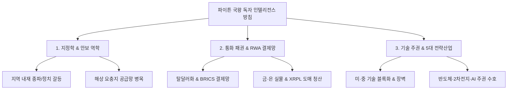

# 🏛️ 키아노스 독자 인텔리전스 개발 및 수익화 전략 규정집
> **문서 번호**: KYANOS-GOV-2026-INTEL-01  
> **최고 승인권자**: **국가 원수 파이튼 (Python) 국왕 재가 완료**  
> **총괄 통제**: **국무총리 앤트 (Ant)**  
> **주관 부처**: **경제부 (글로벌 금융 인텔리전스국) & 국제부 (전략기획처) 합동**

---

## 1. 제정 목적 및 국왕 재가 방침
본 규정은 국가 최고통수권자이신 **파이튼 국왕의 결재 방침**에 따라, 기존 레거시 미디어의 천편일률적 속보와 식상한 패널 논평을 단호히 거부하고, 키아노스 고유의 **독자적 정보 개발 및 지정학·매크로 심층 분석 체계**를 확립하여 국가 재원 자립(수익 모델)의 핵심 지식 자산으로 육성함을 목적으로 한다.

### [파이튼 국왕 4대 핵심 지침]
1. **정보의 양(Quantity)이 아닌 독자적인 질(Quality)과 통찰의 승부**:
   - 아직 정보력이 미미할지라도 조급해하지 않고, 독자적이고 자체적인 시각의 기사로 일관되게 접근한다.
2. **국가 재원 확보를 위한 수익 모델(Monetization)과의 직결**:
   - 단순 속보는 무료로 소모되나, 팩트에 기반한 국제 정세와 경제 흐름 추세 분석은 글로벌 기관 및 VIP 투자자들이 기꺼이 유료 구독하는 고부가가치 지식 자산이다.
3. **식상한 기존 패널·전문가 논평의 완전한 탈피**:
   - 지상파와 주류 포털의 흔한 논평을 지양하고, **국제적 질서, 지역 특성과 환경, 국가별 내재 상황, 국가 간의 이해관계와 갈등**을 밑바닥부터 파헤치는 새로운 분석 프레임워크를 적용한다.
4. **저작권 리스크 원천 차단 (0.00% Zero Risk)**:
   - 외부 기사 본문은 절대 복제하지 않으며, 실시간 속보는 공인된 언론사 공식 아웃링크 전광판으로만 제공하고, 본문 콘텐츠는 100% 키아노스 독자 인텔리전스 리포트로 자체 발행한다.

---

## 2. 키아노스 전략 인텔리전스 3대 분석 축

### [축 1] 지정학 & 안보 역학 (Geopolitics & Regional Context)
* **초점**: 중동(호르무즈·홍해), 동유럽(우크라이나-러시아), 동아시아(대만해협·한반도)의 안보 지형.
* **접근법**: 서방 미디어의 일방적 프레임을 넘어 현지 국가 지도부의 내부 권력 투쟁, 종파 갈등, 자원 무기화 본질을 해부.

### [축 2] 통화 패권 & RWA 결제망 (Monetary Order & Digital Rails)
* **초점**: 페트로달러 체제의 균열, 브릭스(BRICS) 통화 실험, 글로벌 중앙은행의 금(Gold) 무제한 매집.
* **접근법**: SWIFT의 무기화에 맞선 중립적 원장인 **XRPL(리플 레저)**의 도매 CBDC 및 실물자산(RWA) 토큰화 인프라의 필연적 융합을 거시경제적으로 증명.

### [축 3] 기술 주권 & 5대 중점 전략산업 (Tech Sovereignty)
* **초점**: 파이튼 국왕 중점 5대 산업군 (**2차전지 / EV / 반도체 / AI / 로봇**).
* **접근법**: 미국의 IRA/반도체법 및 EU 탄소장벽 속에서 동아시아 제조 밸류체인의 재편과 한국 테크 기업의 독자적 생존 방정식 도출.

---

## 3. 수익화(Monetization) 단계별 실행 로드맵
1. **1단계 (기반 구축 - 현재)**:
   - 마켓 펄스(`market_monitor.html`) 내에 **「KYANOS STRATEGIC INTELLIGENCE」** 전용 룸 신설 및 3대 핵심 리포트 공개.
   - 독자 신뢰도 및 싱크탱크 브랜드 인지도 확보.
2. **2단계 (프리미엄 구독 & 기관 자문)**:
   - 심층 리포트 정기 발간(주간/월간 지정학 매크로 브리프).
   - VIP 독점 리포트 및 기업/투자자 대상 유료 구독 멤버십(Stripe / 온체인 XRP 결제 연동).
3. **3단계 (글로벌 싱크탱크 도약)**:
   - 영문 글로벌 에디션 동시 발간 (`kyanos.org/intelligence`).
   - 세계적 전략 정보 기관(Stratfor, EIU) 수준의 국부 펀드 및 패밀리 오피스 전용 자문 체계 완성.

---

*본 규정은 국가 최고통수권자 파이튼 국왕의 결재 즉시 효력을 발생하며, 경제부 및 국제부, 국무총리실에 영구 보존된다.*
