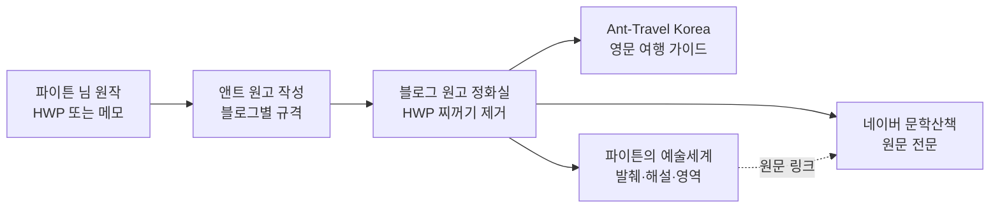

# 🌐 파이튼 공식 3대 블로그 네트워크 재정립 헌장
### (Python Tri-Blog Ecosystem Charter · 제1순위 국정 과업)

> **최종 재가**: 국가원수 **파이튼 (Python)** 님 | **시행 총괄**: 국무총리 **앤트 (Ant)**
> **소관**: 교육·문화부 (경제부 협조) | **시행일**: 2026년 10월 8일
> **근거**: `GEMINI.md` 제13조 (3대 블로그 영구 기억 및 운영 지침)

---

## 1. 3대 블로그 정체성 확정표

| 구분 | 블로그 | 주소 (공개) | 관리자 대시보드 (직접 연결) | 정체성 | 조판 규격 |
| :--- | :--- | :--- | :--- | :--- | :--- |
| 🖋️ **본진** | 『파이튼의 문학산책』 (네이버) | https://blog.naver.com/invision | https://admin.blog.naver.com/invision | 파이튼 순수 창작물의 **출판 원본 금고** | 스마트에디터 (평문) |
| ✈️ **글로벌 #1** | 『Ant-Travel Korea』 (구글) | https://antkoreatrip.blogspot.com | https://www.blogger.com/blog/posts/9119618905484144503 | 외국인 여행자용 **영문 K-Travel 가이드** | 클린 HTML · SEO 5단 구조 |
| 🤖 **글로벌 #2** | 『파이튼의 초지능(SI) 미래 오디세이』 (구글) | https://phaetonktb.blogspot.com | https://www.blogger.com/blog/posts/4640767143667658473 | **초지능(SI) R&D·미래 산업·과학적 이상향** | 클린 HTML · 미래 비전 리포트 |

> [!NOTE]
> 2026년 10월 9일 파이튼 님의 최종 재가에 따라, 구글 블로그 #2를 기존 문학 큐레이션에서 **『초지능(SI) 미래 오디세이』**로 전면 전환하였습니다. AI 연구·개발 트렌드, 미래 5대 AI 산업 전망, SF적 상상력과 과학적 이상향이 융합된 고부가가치 미래 싱크탱크로 운영됩니다.

---

## 2. 중복 문서 방지 및 운영 원칙 (네이버 ↔ 구글)

1. **문학 창작물은 네이버에 집중.** 파이튼 님의 수필·시·회고록 등 순수 문학은 『파이튼의 문학산책』에 온전히 보존합니다.
2. **구글 #2는 오직 'AI & 초지능(SI) 미래 비전'만 다룬다.** 현실적 R&D/산업 분석과 이상적 과학 청사진을 결합하여 고품격 전문 칼럼을 연재합니다.
3. **한글(HWP)에서 블로그로 바로 붙여넣지 않는다.** 반드시 `블로그_원고_정화실.html`을 거쳐 `hwp_editor_board_content`, `data-hwpjson`, `mso-*` 인라인 스타일을 없앤 클린 원고만 올립니다.

---

## 3. 블로그별 카테고리 표준

### 🖋️ 『파이튼의 문학산책』 (네이버)
1. 사색의 창 — 파이튼 에세이 (몽테뉴·피천득의 결)
2. 어떤 인생의 일대기 — 연재형 회고록 (회차 번호 붙임)
3. 시선(詩仙)의 화첩 — 창작 시와 해설
4. 인생의 명곡 — 팝송 스토리텔링
5. 동서양의 지혜 — 고문진보·격언·인문
6. 길 위의 사진첩 — 사진·여행 회상 (한국어 감상기)

### ✈️ 『Ant-Travel Korea』 (구글)
1. **Korea Hidden Gems** — 숨은 로컬 명소
2. **K-Cycling & River Trails** — 한국 강변 자전거 길
3. **Global Horizons** — 철학자의 세계 여행기
4. **Practical Korea Guide** — 교통·음식·예절 실용 정보
- 지역 라벨 유지: Seoul · Gyeonggi · Incheon · Gangwon …

### 🤖 『파이튼의 초지능(SI) 미래 오디세이』 (구글)
1. **AI R&D & Tech Frontier** — 초지능 연구개발, 신경망 반도체, 양자 AI
2. **Future AI Economy** — 미래 5대 산업(로봇, 자율주행, 바이오, 2차전지, 에너지), 부의 기회
3. **Civilization & Sci-Fi Vision** — 인류와 SI의 공존, 우주 개척 로봇, 초연결 스마트 도시
4. **SI Ethics & Governance** — 초지능 윤리, 덕치(德治) 거버넌스, 인류 존엄성 보호

---

## 4. 원고 발행 흐름

1. 파이튼 님은 원작(HWP·메모·사진 폴더)만 주시면 됩니다.
2. 앤트가 `templates/`의 규격으로 블로그별 원고를 만듭니다.
3. `블로그_원고_정화실.html`에서 해당 블로그를 고르고 원고를 붙여넣은 뒤 **[복사]** 한 번.
4. 각 블로그 편집기에 붙여넣으면 끝입니다. (구글 블로그는 **HTML 보기**에 붙여넣기)

---

## 5. 보관 문서 및 바로가기

| 파일 | 용도 |
| :--- | :--- |
| `블로그_원고_정화실.html` | 3대 블로그 관제 + HWP 원고 정화·변환 도구 (Edge 전용) |
| `키아노스_3대블로그_관제실.url` | 위 도구 바로 열기 |
| `antkoreatrip_시범원고_1호_선유도공원.html` | 『Ant-Travel Korea』 시범 원고 1호 클린 HTML (Blogger 즉시 게시용) |
| `antkoreatrip_시범원고_1호_선유도공원_안내문.md` | 시범 원고 1호 기획 배경, SEO 전략 및 사진 매칭 안내문 |
| `예술세계_92편_전수점검_및_해설판_전환목록.md` | 『파이튼의 예술세계』 92편 전수 점검 대장 및 해설판 전환 로드맵 |
| `templates/naver_munhak_template.md` | 네이버 원고 규격 |
| `templates/antkoreatrip_post_template.html` | 영문 여행 포스트 규격 (SEO 5단 구조) |
| `templates/phaetonktb_post_template.html` | 예술세계 한·영 큐레이션 규격 |

---

## 6. 진행 현황

- [x] **1단계** 3대 블로그 정체성·조판 표준 확정 (본 헌장)
- [x] **2단계** 원고 규격(템플릿 3종) + HWP 정화 도구 구축
- [x] **3단계** 교육·문화부 폴더·바로가기·국가 사업 대장 반영
- [x] **4단계** 『Ant-Travel Korea』 시범 개편 원고 1호 완성 (`D:\My photo\korea\선유도\` 사진 매칭 및 Mistral 7B 영문 윤문)
- [x] **5단계** 『예술세계』 기존 92편 전수 분석 대장 완성 (네이버 중복 진단, HWP 코드 검출 및 Exaone 3.5 비평 테스팅)
