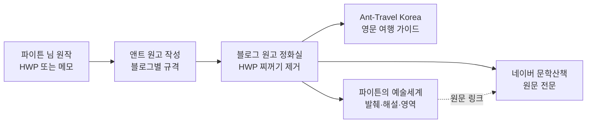

# 🌐 파이튼 공식 3대 블로그 네트워크 재정립 헌장
### (Python Tri-Blog Ecosystem Charter · 제1순위 국정 과업)

> **최종 재가**: 국가원수 **파이튼 (Python)** 님 | **시행 총괄**: 국무총리 **앤트 (Ant)**
> **소관**: 교육·문화부 (경제부 협조) | **시행일**: 2026년 10월 8일
> **근거**: `GEMINI.md` 제13조 (3대 블로그 영구 기억 및 운영 지침)

---

## 1. 3대 블로그 정체성 확정표

| 구분 | 블로그 | 주소 | 정체성 | 언어 | 조판 규격 |
| :--- | :--- | :--- | :--- | :--- | :--- |
| 🖋️ **본진** | 『파이튼의 문학산책』 (네이버) | https://blog.naver.com/invision | 파이튼 순수 창작물의 **출판 원본 금고** | 한국어 | 스마트에디터 서식 (평문 붙여넣기) |
| ✈️ **글로벌 #1** | 『Ant-Travel Korea』 (구글) | https://antkoreatrip.blogspot.com | 외국인 여행자용 **영문 K-Travel 가이드** | 영어 | 클린 HTML · 여행 SEO 5단 구조 |
| 🎨 **글로벌 #2** | 『파이튼의 예술세계』 (구글) | https://phaetonktb.blogspot.com | 인문·예술 세계의 **구글 SEO판 큐레이션** | 한·영 | 클린 HTML · 발췌+해설+영역+원문 링크 |

> [!NOTE]
> 경제부 `KYANOS_SI_5_REVENUE_AND_BLOG_STRATEGY.md`에는 『파이튼의 예술세계』를 테크·금융 저널로 바꾸자는 안이 실려 있습니다. 그러나 이후 영구 등재된 `GEMINI.md` 제13조가 **인문·예술 블로그 유지 + 한·영 큐레이션 차별화**로 정했으므로, 본 헌장은 제13조를 따릅니다. 테크·금융 글은 앤트뉴스(`antnews`)가 맡습니다.

---

## 2. 중복 문서 방지 3대 철칙 (네이버 ↔ 구글)

1. **원문은 네이버에 한 번만 싣는다.** 파이튼 님의 한국어 원작 전문은 『파이튼의 문학산책』에만 싣습니다.
2. **구글 『예술세계』에는 같은 글을 그대로 옮기지 않는다.** 아래 셋 중 하나 이상으로 새로 짜서 올립니다.
   - ① **발췌 + 앤트 해설** (원문 30% 이내 인용, 문학적 배경·해설을 새로 씀)
   - ② **한·영 대역본** (핵심 연·문단 영역 + 영어권 독자용 소개)
   - ③ **주제별 큐레이션** (예: "고문진보로 읽는 가을" — 여러 편을 엮은 새 글)
   - 맨 아래에는 항상 **"전문은 네이버 『파이튼의 문학산책』에서"** 원문 링크 카드를 붙입니다.
3. **한글(HWP)에서 블로그로 바로 붙여넣지 않는다.** 반드시 `블로그_원고_정화실.html`을 거쳐 `hwp_editor_board_content`, `data-hwpjson`, `mso-*` 인라인 스타일을 없앤 클린 원고만 올립니다.

---

## 3. 블로그별 카테고리 표준

### 🖋️ 『파이튼의 문학산책』 (네이버)
1. 사색의 창 — 파이튼 에세이 (몽테뉴·피천득의 결)
2. 어떤 인생의 일대기 — 연재형 회고록 (회차 번호 붙임)
3. 시선(詩仙)의 화첩 — 창작 시와 해설
4. 인생의 명곡 — 팝송 스토리텔링
5. 동서양의 지혜 — 고문진보·격언·인문
6. 길 위의 사진첩 — 사진·여행 회상 (한국어 감상기)

### ✈️ 『Ant-Travel Korea』 (구글)
1. **Korea Hidden Gems** — 숨은 로컬 명소
2. **K-Cycling & River Trails** — 한국 강변 자전거 길
3. **Global Horizons** — 철학자의 세계 여행기
4. **Practical Korea Guide** — 교통·음식·예절 실용 정보
- 지역 라벨 유지: Seoul · Gyeonggi · Incheon · Gangwon …

### 🎨 『파이튼의 예술세계』 (구글)
1. Storytelling — 명곡·인물 스토리 (해설판)
2. Sijo & Poems — 시조·자작시 (한·영 대역)
3. Beloved Poems — 애송시 큐레이션
4. Classical Wisdom — 고문진보 (원문·독음·풀이·영역)
5. Proverbs — 동서양 격언 (한·영)

---

## 4. 원고 발행 흐름

1. 파이튼 님은 원작(HWP·메모·사진 폴더)만 주시면 됩니다.
2. 앤트가 `templates/`의 규격으로 블로그별 원고를 만듭니다.
3. `블로그_원고_정화실.html`에서 해당 블로그를 고르고 원고를 붙여넣은 뒤 **[복사]** 한 번.
4. 각 블로그 편집기에 붙여넣으면 끝입니다. (구글 블로그는 **HTML 보기**에 붙여넣기)

---

## 5. 보관 문서 및 바로가기

| 파일 | 용도 |
| :--- | :--- |
| `블로그_원고_정화실.html` | 3대 블로그 관제 + HWP 원고 정화·변환 도구 (Edge 전용) |
| `키아노스_3대블로그_관제실.url` | 위 도구 바로 열기 |
| `templates/naver_munhak_template.md` | 네이버 원고 규격 |
| `templates/antkoreatrip_post_template.html` | 영문 여행 포스트 규격 (SEO 5단 구조) |
| `templates/phaetonktb_post_template.html` | 예술세계 한·영 큐레이션 규격 |

---

## 6. 진행 현황

- [x] **1단계** 3대 블로그 정체성·조판 표준 확정 (본 헌장)
- [x] **2단계** 원고 규격(템플릿 3종) + HWP 정화 도구 구축
- [x] **3단계** 교육·문화부 폴더·바로가기·국가 사업 대장 반영
- [ ] **다음 단계** 『Ant-Travel Korea』 시범 개편 원고 1호 (`photo world` 사진 활용) — 파이튼 님이 주제를 정해 주시면 시작
- [ ] **다음 단계** 『예술세계』 기존 92편 중 네이버와 중복된 글 점검 및 해설판 전환 목록 작성
